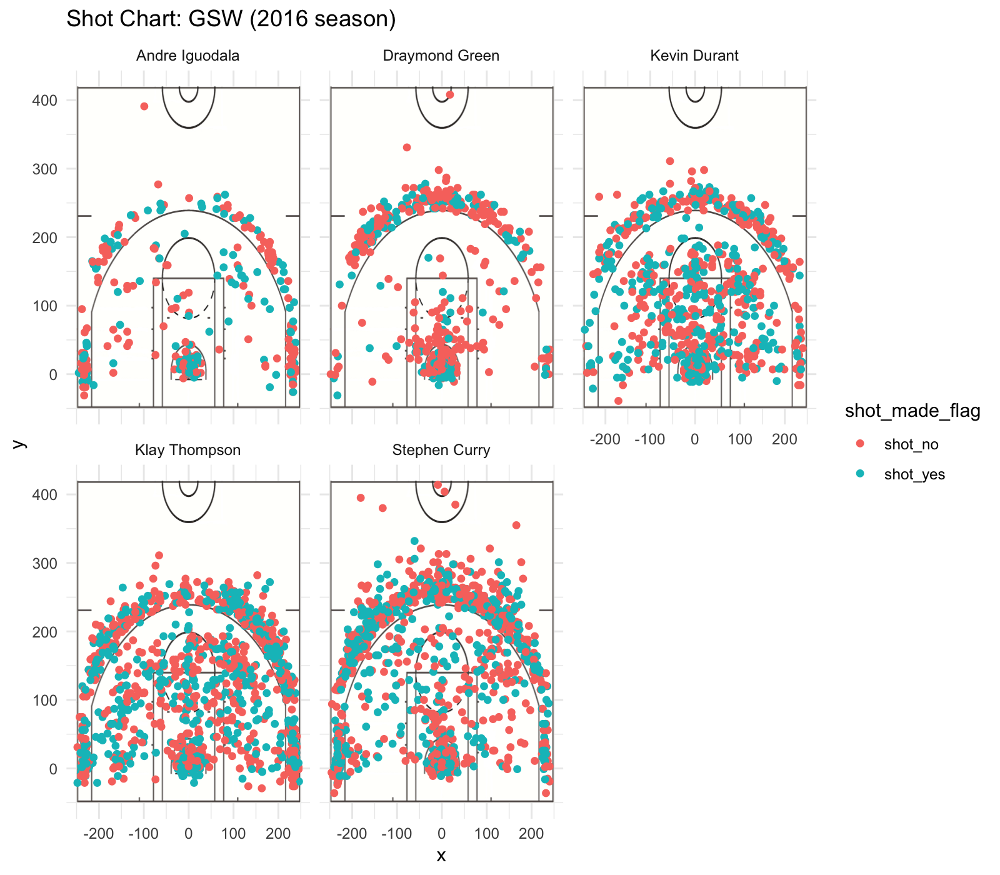

GSW Shot Charts: Report
================
Yuxin Mei
3/12/2019

0) Library Some Packages in R
-----------------------------

``` r
library(dplyr)
library(ggplot2)
library(knitr)
```

------------------------------------------------------------------------

1) Effective Shooting Percentage
--------------------------------

Read the data in shots-data.csv:

``` r
shots <- read.csv(file = "../data/shots-data.csv", stringsAsFactors =  FALSE)
```

-   **2PT Effective Shooting % by Player**: (descending order)

``` r
TwoPT_Effective_Shooting <- shots %>%
  filter(shot_type == "2PT Field Goal") %>%
  group_by(name) %>%
  summarise(total = length(shot_made_flag), made = sum(shot_made_flag == "shot_yes"), perc_made = made / total) %>%
  select(name, total, made, perc_made) %>%
  arrange(desc(perc_made))  

kable(TwoPT_Effective_Shooting)
```

| name           |  total|  made|  perc\_made|
|:---------------|------:|-----:|-----------:|
| Andre Iguodala |    210|   134|   0.6380952|
| Kevin Durant   |    643|   390|   0.6065319|
| Stephen Curry  |    563|   304|   0.5399645|
| Klay Thompson  |    640|   329|   0.5140625|
| Draymond Green |    346|   171|   0.4942197|

-   **3PT Effective Shooting % by Player**: (descending order)

``` r
ThreePT_Effective_Shooting <- shots %>%
  filter(shot_type == "3PT Field Goal") %>%
  group_by(name) %>%
  summarise(total = length(shot_made_flag), made = sum(shot_made_flag == "shot_yes"), perc_made = made / total) %>%
  select(name, total, made, perc_made) %>%
  arrange(desc(perc_made))

kable(ThreePT_Effective_Shooting) 
```

| name           |  total|  made|  perc\_made|
|:---------------|------:|-----:|-----------:|
| Klay Thompson  |    580|   246|   0.4241379|
| Stephen Curry  |    687|   280|   0.4075691|
| Kevin Durant   |    272|   105|   0.3860294|
| Andre Iguodala |    161|    58|   0.3602484|
| Draymond Green |    232|    74|   0.3189655|

-   **Effective Shooting % by Player**: (descending order)

``` r
Effective_Shooting <- shots %>%
  group_by(name) %>%
  summarise(total = length(shot_made_flag), made = sum(shot_made_flag == "shot_yes"), perc_made = made / total) %>%
  select(name, total, made, perc_made) %>%
  arrange(desc(perc_made))

kable(Effective_Shooting) 
```

| name           |  total|  made|  perc\_made|
|:---------------|------:|-----:|-----------:|
| Kevin Durant   |    915|   495|   0.5409836|
| Andre Iguodala |    371|   192|   0.5175202|
| Klay Thompson  |   1220|   575|   0.4713115|
| Stephen Curry  |   1250|   584|   0.4672000|
| Draymond Green |    578|   245|   0.4238754|

------------------------------------------------------------------------

2) Narrative
------------

### 1. **Introduction**:

Being 1st in NBA Western Conference, Golden State Warriors (GSW) did such a great job in 2016-17 season! And we're now analysing five players in this woderful team! They are [Kevin Durant](https://en.wikipedia.org/wiki/Kevin_Durant), [Andre Iguodala](https://en.wikipedia.org/wiki/Andre_Iguodala), [Klay Thompson](https://en.wikipedia.org/wiki/Klay_Thompson), [Stephen Curry](https://en.wikipedia.org/wiki/Stephen_Curry), and [Draymond Green](https://en.wikipedia.org/wiki/Draymond_Green).


We have the data of their action type, shot type, shot distance, shot position and time left after the shot in each game. By summarising and visualizing, we can compare the information of five players and figure out some of their personal characteristics.

### 2. **Basic Information of Five Players** (from data)

-   **Effective Shooting Percentage**:

From the diagrams in previous section, total shots, made shots and percentage are listed for each player.
Stephen Curry and Klay Thompson made the most total shots while Kevin Durant and Andre Iguodala had the highest hitting accuracy that over 50%. Andre Iguodala had the highest 2PT Effective Shooting of over 60%. Stephen Curry and Klay Thompson, performed relatively better when they made 3PT shots with the effective percentage of over 40%.

-   **Total Shots**:

Notice here *Andre Iguodala* had far less total shots than others, he tends to guard more than shooting. *Draymond Green* also failed to shoot more than 600 times, half of the *Stephen Curry* and *Klay Thompson*'s record. However, he was found to be good at assisting. From [Wikipedia](https://en.wikipedia.org/wiki/Draymond_Green), we know that "on February 10, 2017, Green scored only four points but finished with 12 rebounds, 10 assists and 10 steals as the Warriors defeated the Memphis Grizzlies 122–107." And "his triple-double was the first in NBA history with fewer than 10 points scored. It also was only the second in NBA history with at least 10 rebounds, 10 assists and 10 steals in a game."

-   **Shot Type**:

| name           |  TwoPT\_total|  ThreePT\_total|  total|
|:---------------|-------------:|---------------:|------:|
| Andre Iguodala |           210|             161|    371|
| Draymond Green |           346|             232|    578|
| Kevin Durant   |           643|             272|    915|
| Klay Thompson  |           640|             580|   1220|
| Stephen Curry  |           563|             687|   1250|

It can be easily found that *Stephen Kurry* prefered shooting from a far distance and he was the only one that tried three-point shots more than two-point shots. *Kevin Durant*, on the other hand, made two-point shots approximately three times as many as three-point shots. He showed the tendency of focusing on shooting closer to backboard. Klay Thompson showed no obvious preference to either two-point shots or three-point shots. Andre Iguodala and Draymond Green might choose two-point shots more often.

-   **Action Type**:

| Andre Iguodala        | Draymond Green  | Kevin Durant          | Klay Thompson         | Stephen Curry         |
|:----------------------|:----------------|:----------------------|:----------------------|:----------------------|
| Jump Shot :179        | Jump Shot :240  | Jump Shot :348        | Jump Shot :688        | Jump Shot :596        |
| Pullup Jump shot : 34 | Layup Shot : 59 | Pullup Jump shot :114 | Pullup Jump shot :171 | Pullup Jump shot :158 |

As shown in the table, **Jump Shot** is the most prefered action type for all of the five players. Except *Draymond Green*, others' second choice is **Pullup Jump Shot**. *Draymond Green* choosed **Layup Shot** instead.

-   **Shooting Position**:



The image contains five players' shooting positions. The amount of points directly shows the number of total shots made by each player, which corresponds to the analysis in the previous **Total Shots**.

What capture my eye at first are the points even further out of the three-point line. Although *Klay Thompson* and *Stephen Curry* shot quite often out of the three-point line, *Klay Thompson* seldom tried further shooting while *Stephen Curry* shot even in the Backcourt. *Kevin Durant* rarely shot behind the line noted 300 in the image.

It's found that there are some blanks just within the three-point line, which means the places there are relatively hard, or considered not the best, to make shot. The prefered shooting positions by all of the five player are places below the basket and out of three-point line (and close to it).

### 3. **Summary**

As in part 2, Effective Shooting Percentage, Total Shots, Shot Type, Action Type, and Shooting Position are analysed. Five players had something in common but still kept their personal characteristics.
